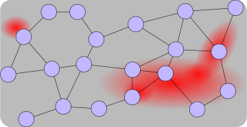
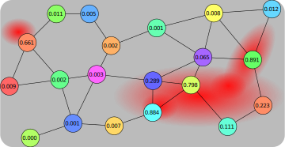
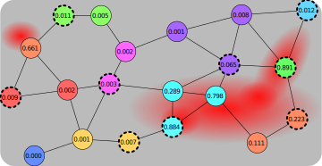
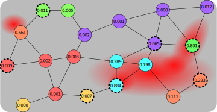
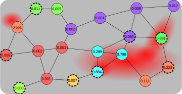
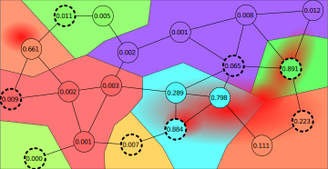
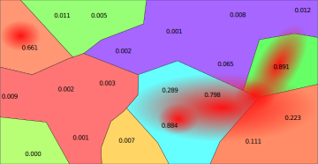
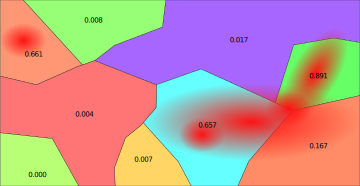
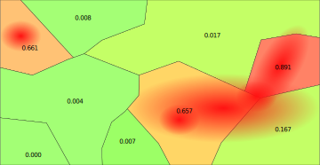

 
+++

title = "Space-fluid Adaptive Sampling: a Field-based, Self-organising Approach"
description = "An adaptive way to sample signals that vary in space"
outputs = ["Reveal"]
aliases = [
    "/guide/"
]

+++




# **Space-fluid Adaptive Sampling**: a Field-based, Self-organising Approach

* Roberto Casadei
* Stefano Mariani
* *Danilo Pianini* $\Leftarrow$ it'sa mee
* Mirko Viroli
* Franco Zambonelli

---



---



---



# Pollution monitoring and counter-action

* **Context** - Air pollution *sensors distributed* in a geographical area
  * Distribution is irregular and may change with time
  * Of course sensors' readings change with time, too
* **Goal** - apply *specific policies to areas* where pollution is too high
  * e.g., limit thermal cars traffic, limit non-electric heating, etc.
* **Strategy** - Find a way to *group sensor readings in space*
  * One area $\to$ one reading $\to$ one policy

---



---



# Idea

*Partition* the space based on **both**
* geographical contiguity **and**
* *"coherence"* of sensors' readings

We want to obtain the **largest** possible regions
(as **few** of them as possible)
while *keeping the error under control*

$\to$ with **no central coordinator**

---



---



---



---



# Aggregate sampling

* A **stabilising computation**
  * *eventually static input* $\to$ *eventually stable output*
* producing a **regional partition field**
  * A *stabilising field*
  * *Contiguous in space*
* by accumulating an **aggregate sampling error**
  * Any monothonic function $f: \mathbb{R}\times\mathbb{R}^*\to\mathbb{R}_{>0}$ measuring the error between the local data and its surroundings
  * Accumulated through a monothonically increasing function 
* and keeping it under a **threshold $\eta$**.
  * The partition border is where the error threshold is reached

---



## Aggregate-computing-based solution



---



* Every device *proposes itself as a valid candidate* with some strength
* The strength *may*  be the sensor reading, but any policy is fine



---



* Candidacy get *exchanged*. Here, both distance and variance accumulate error
* If they are *within the allowed error* $\eta$, they compete and the strongest survives



---



* Max distance: 2-hop: some areas *stop spreading*
* "Leader" devices have dashed border, some lose their status in the process



---



* Until the situation is *stabilised*



---



* We can visualise the partitions



---



* Also hiding the node location



---



* And consider an output value for the whole area (in this case, the average)



---



* Same as before, but colors are mapped to values



---



# Actual Implementation

A **reusable artifact** has been produced for this work
* [https://github.com/DanySK/Experiment-2022-Coordination-Space-Fluid](https://github.com/DanySK/Experiment-2022-Coordination-Space-Fluid)
* DOI: [10.5281/zenodo.6590180](https://doi.org/10.5281/zenodo.6590180)

The implementation is in the process of being merged into the [Protelis](http://protelis.github.io/)-lang library

```scala
def localLeaderElection(uid, strength, radius, metric, distance) {
  share (lead, nbrLead <- [uid, [strength, 0]]) {
    alignedMap( // Expand a "bubble" with the local information
      [nbrLead], // Remove "bubbles" that accumulated too much error 
      { candidate, breaker -> candidate==uid || foldMin(∞, breaker.get(1)+metric()) < radius },
      { candidate, breaker -> // Let overlapping bubbles compete
        let gradient = distance(source) // error accumulation
        [gradcast(uid==candidate && idOf(lead)==uid, strength, gradient, identity), gradient]
      }, // default to the worst value if no valid bubble is present in the neighborhood
      [-∞, ∞] // Then select the area the device belongs
    ).fold(default) { a, b -> if (tieBreakerOf(a) > tieBreakerOf(b)) { a } else { b } }
  }.get(0) // return the uid of the partition leader
}
```

---



# Evaluation

### Desiderata

* **stabilisation**: if the input is stable, the output must be stable
* **high information (entropy)**: *increase the number of regions* to minimise errors
* **error-controlled upscaling**: create the *minimum number of regions* necessary to keep the error under threshold

---



# Metrics

Assuming a set of devices $D$ partitioned into a set of regions
$R = R_1 \cup \dots \cup R_{|R|}$
where each $R_r$ is a set of devices
$\{ D^{r}_1,\ \dots, D^{r}\_{|R_r|} \} $
and each device $D^r_d$ reads the local value of the tracked signal $s^r_d$:

* **Region count** $|R|$
* **Mean region size** $\mu_{R}$
* **Standard deviation of the mean of the signal in regions** $\sigma(\mu_s)$
  * Proxy for *inter-region diff.*; high $\to$ regions differ with each other $\to$ better
* **Mean standard deviation of the signal in regions**
  * Proxy for *intra-region error*, low $\to$ regions internally similar $\to$ better
* **Std. dev. of the std. dev. of the signal in regions** $\sigma(\sigma_s)$
  * Proxy for *partition consistency*; high $\to$ regions behave differently $\to$ better

---



# Topologies
## regular grid



---



# Topologies
## irregular (perturbed) grid



---



# Topologies
## uniform random



---



# Topologies
## exponentially distributed



---



# Spatial signals

* **Constant**: all sensors read the same value everywhere
  * Minimum number of *large regions*
* **Uniform** (random): sensors read a random value, maximum entropy
  * Maximum information, *many small regions* wanted
* **Bivariate Gaussian**: the signal is highest at the center of the network and progressively lower towards the edges
  * *Many small regions along the slope*, few large regions at the network edge
* **Multiple Bivariate Gaussians**: three bivariates located along the diagonal
  * Similar to the previous, but with different geometry (to intercept potential issues due to *symmetry*)
* **Dynamic**: the system cycles across the previous signals at pre-defined intervals
  * useful to study the dynamics and *self-stabilisation*

---



## Leader strength

* **local signal value**
* **neighbourhood-mean of the signal value**
* **neighbourhood-variance of the signal value**

## Error accumulation metric
* **distance** (ignores the actual error)
* **difference between the signal readings**
  * actually min($\epsilon$, $|s_a - s_b|$) where $\epsilon \in \mathbb{R_+}$, $\epsilon = 0$ iff $a=b$, $0 < \epsilon \ll 1$ otherwise
  (to preserve the triangle inequality)
* **mix**: product of the previous two metrics

---



# Experiment setup

[](https://alchemistsimulator.github.io/)
[](https://alchemistsimulator.github.io/)

* *Cartesian product* of all topologies, signals, leader strenght functions, and error accumulation metrics
* *100 repetitions* (with different seeds)
* *630 charts* (available in the artifact repository)
* Data generation requires weeks on a normal PC
  * $\to$ Generated data is provided in the repository for further data analysis

---

# Main results


# Headers

# H1
## H2
### H3
#### H4

---

# Text

normal text

`inline code`

*italic*

**bold**

**_emphasized_**

*__emphasized alternative__*

~~strikethrough~~

[link](http://www.google.com)

---

# Lists and enums

1. First ordered list item
1. Another item
    * Unordered sub-list.
    * with two items
        * another sublist
            1. With a sub-enum
            1. yay!
1. Actual numbers don't matter, just that it's a number
  1. Ordered sub-list
1. And another item.

---

# Inline images


---

## Fallback to shortcodes for resizing

Autoresize specifying

* `max-w` (percent of parent element width) and/or `max-h` (percent of viewport height) as max sizes , and
* `width` and/or `height` as *exact* sizes (as percent of viewport size)



---

## Low res, plain markdown


---

## Hi res, plain markdown


---

## Low res, default



---

## Hi res, default



---

## Low res, enlarged horizontally



---

## Low res, enlarged vertically



---

## Hi res, reduced horizontally



---

## Hi res, reduced vertically



---

## Hi res, reducing maximum expansion horizontally



---

## Hi res, reducing maximum expansion vertically



---



# Large images as background
## (May affect printing)

---



# Also available with blur and custom transitions
## (May affect printing)

---

# $$\LaTeX{}$$


Inline equations like $E=mc^2$

$$\frac{n!}{k!(n-k)!} = \binom{n}{k}$$  

---

# Code snippets


```kotlin
val x = pippo
```

```go
package main
 
import "fmt"
 
func main() {
    fmt.Println("Hello world!")
}
```

---

# Tables

Colons can be used to align columns.

| Tables        | Are           | Cool  |
| ------------- |:-------------:| -----:|
| col 3 is      | right-aligned | $1600 |
| col 2 is      | centered      |   $12 |
| zebra stripes | are neat      |    $1 |

There must be at least 3 dashes separating each header cell.
The outer pipes (|) are optional, and you don't need to make the 
raw Markdown line up prettily. You can also use inline Markdown.

---

# Quotes

> Multiple
> lines
> of
> a
> single
> quote
> get
> joined

> Very long one liners of Markdown text automatically get broken into a multiline quotation, which is then rendered in the slides.

---

# Fragments

* 
* 
* 

---

# Graphs via Gravizo


  digraph G {
    aize ="4,4";
    main [shape=box];
    main -> parse [weight=8];
    parse -> execute;
    main -> init [style=dotted];
    main -> cleanup;
    execute -> { make_string; printf}
    init -> make_string;
    edge [color=red];
    main -> printf [style=bold,label="100 times"];
    make_string [label="make a string"];
    node [shape=box,style=filled,color=".7 .3 1.0"];
    execute -> compare;
  }


